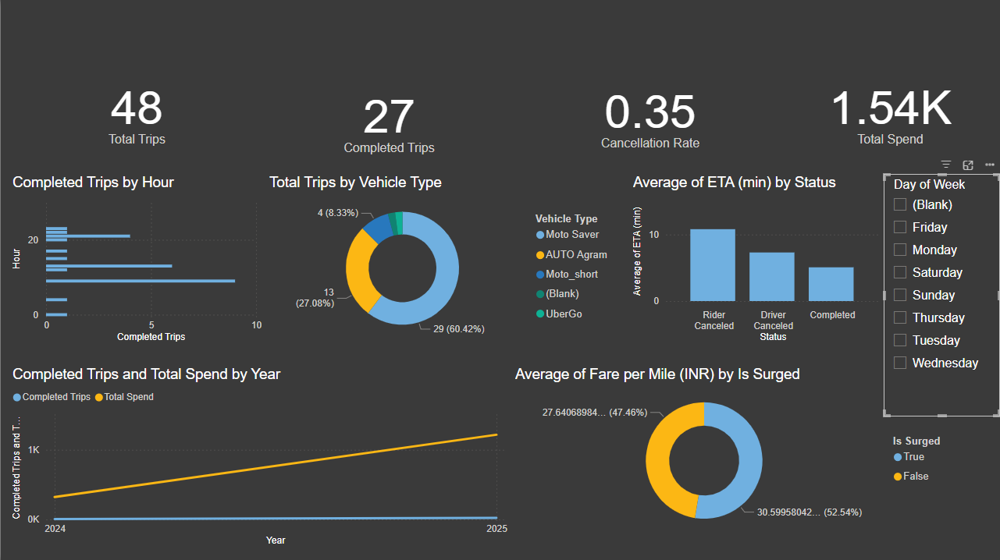

# Personal Ride-Data Analysis

A Power BI dashboard analyzing my own Uber ride history — built to understand my commute patterns, cancellation behavior, and spending.

## Project Goal

I wanted to know: how much of my ride-hailing usage is actually a home↔office commute, why do so many of my requests get canceled, and where does the money go? This project pulls that apart using a personal Uber ride export.

## Data Source

The dataset is my own Uber ride history export (Sep 2024 – Aug 2025, Bangalore), covering 47 requested trips. Pickup/dropoff locations have been generalized into `Home Area`, `Office`, and `Other` tags — the cleaned CSV in [`data/trip_data_cleaned.csv`](data/trip_data_cleaned.csv) contains no literal addresses or place names.

## Key Findings

- **Commute-dominated usage**: 19 of 27 completed trips (70%) started from the same residential area, and 15 of 27 (56%) ended at the same office building — this is primarily a home-to-office commute tool, not general-purpose travel.
- **Cancellation rate driven by wait time**: 36.2% of all 47 requested trips were canceled by the rider. Canceled trips had an average estimated wait of ~10.8 minutes, versus ~5.1 minutes for completed trips — wait time appears to be the dominant driver of cancellations.
- **Peak usage at commute hours**: rides cluster heavily around 9 AM and 1 PM, consistent with a morning office commute and a midday (lunch or return) trip.
- **Cost-conscious vehicle choice**: 70% of all requests were for 2-wheeler options (Moto Saver / Moto Short) rather than car options — the cheaper mode is strongly preferred for these short commute-distance trips.
- **Surge premium is real but modest**: on a fare-per-mile basis, surge-tagged trips cost about 8% more per mile than non-surge trips (₹30.6/mi vs ₹28.3/mi).
- **Total spend**: ₹1,536.90 across 27 completed trips, averaging ₹56.92/trip (₹44.88/trip excluding one 21-mile outlier ride).
- **Driver ratings given**: averaged 4.69/5 across 26 rated trips, with only 2 one-star ratings.

## Dashboard




## Opening the Dashboard Yourself

The full interactive dashboard is in [`Ride_Data_Analysis.pbix`](Ride_Data_Analysis.pbix). To open it:

1. Install [Power BI Desktop](https://www.microsoft.com/en-us/power-platform/products/power-bi/downloads/power-bi-desktop) (free, Windows).
2. Open the `.pbix` file directly — no additional setup or data connections required.

## Repo Structure

```
personal-ride-data-analysis/
├── README.md
├── Ride_Data_Analysis.pbix
├── Ride_Data_Dashboard.xlsx
├── data/
│   └── trip_data_cleaned.csv
├── screenshots/
│   ├── dashboard_overview.png
│   ├── hourly_pattern.png
│   └── cancellation_analysis.png
└── LICENSE
```
